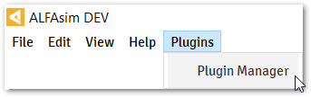
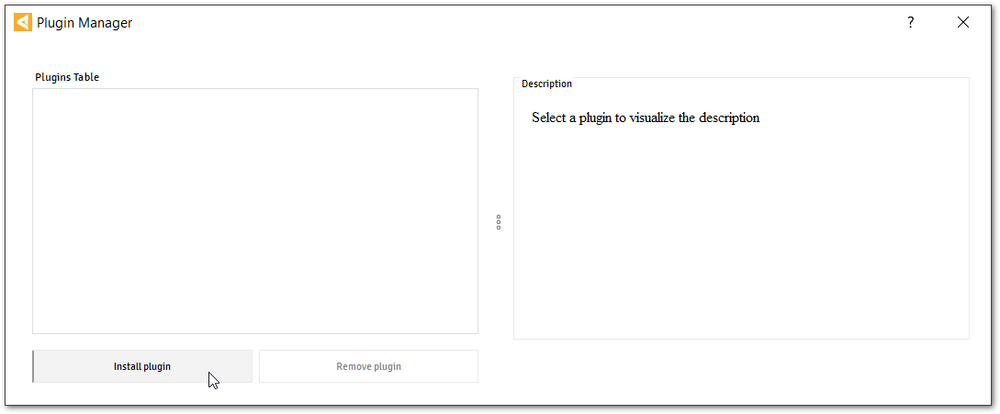
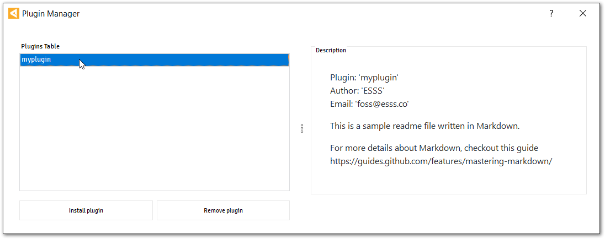
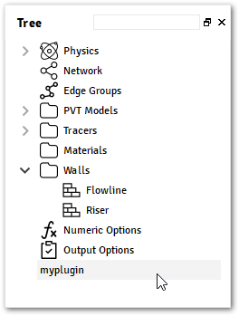

.. _quick-start-section:

Quick Start
===========

In this section, it is shown how to create a plugin from scratch with the template command provided by |sdk|.
With this template, you can easily customize your application to extend |alfasim| functionality.

This allows you to experience the complete creation of a plugin workflow in a short time.

Set up the environment
----------------------

The |sdk| is a Python package that helps developers in the process to create a Plugin for |alfasim|, to use
this tool it is necessary to have a Python Interpreter with at least version 3.6. For more details on how to install Python `check
the official docs <https://www.python.org/downloads/>`_.

.. note::

    It is recommended that you install the |sdk| using a Python Virtual Environment.
    For more details, see `Virtual Environments and Packages in Python documentation <https://docs.python.org/3/tutorial/venv.html>`_.

From a terminal, and inside a virtual environment, update pip:

.. code-block:: console

    >>> python -m pip install -U pip

Install the |sdk| with:

.. code-block:: console

    >>> pip install alfasim-sdk

Also, make sure to have at least the following version for this software:

 - ``CMake`` at least version 3.5.2
 - ``Ninja`` at least version 1.7.0

The ``alfasim-sdk`` package has several commands that can be visualized by running the help option.

.. code-block:: bash

   >>> alfasim-sdk --help

Creating a Plugin Project
-------------------------

To create a new project, run:

.. code-block:: bash

   >>> alfasim-sdk template

After the execution of the command above, you will be prompted to fill the following options (all required):

.. code-block:: bash

    >>> alfasim-sdk template
    ... -- Plugin Caption: Myplugin
    ... -- Plugin Id: myplugin
    ... -- Author Name: ESSS
    ... -- Author Email: <email>@<server>

:Plugin Caption: The caption to be used across the application to identify the plugin.
:Plugin Id: The name of the plugin to be referenced during the development.
:Author Name: Name of the plugin author to be displayed.
:Author Email: Email of the plugin author to be displayed.

To check all options, call the help command:

.. code-block:: bash

   >>> alfasim-sdk template --help

After the execution of the :program:`template` command the generated plugin project will have the following structure:

.. code-block:: bash

    \---myplugin
        |   CMakeLists.txt
        |   compile.py
        |
        +---assets
        |       plugin.yaml
        |       README.md
        |
        \---src
            |   CMakeLists.txt
            |   hook_specs.h
            |   myplugin.cpp
            |
            \---python
                    myplugin.py

The highlights here are for:

:plugin.yaml: File with all information about the plugin that will be used by |alfasim|.
:myplugin.py: Implementation of the hooks for customization of the UI interface, or the solver configuration hooks.
:myplugin.c:  Implementation of the hooks for customization of solver.

Check out the :ref:`Plugin Structure section <plugin_structure-section>` for more details about how the folder and files are structured, and
also, check the :ref:`plugin-by-example-section` that shows how to create simple plugins that make use of the `User Interface Hooks` and the `Solver Hooks`.

Creating a package
------------------

From the root directory of the plugin, execute the command `alfasim-sdk package`.
This command will compile your C/C++ implementation and include the shared libraries inside a `artifacts` directory and
the generated plugin on the root directory with the extension `hmplugin`.

.. code-block:: bash

    >>> cd myplugin
    >>> alfasim-sdk package
    ... -- Package Name: myplugin

The plugin directory will have the following structure when executing from a `Windows Operating System`:

.. code-block:: bash

    \---myplugin
        |   CMakeLists.txt
        |   compile.py
        |   myplugin-1.0.0-win64.hmplugin
        |
        +---artifacts
        |       myplugin.dll
        |       myplugin.lib
        |
        +---assets
        |       plugin.yaml
        |       README.md
        |
        +---build
        |       < ... >
        |       < ... >
        |
        +---package
        |       myplugin.dll
        |       plugin.yaml
        |       README.md
        |
        \---src
            |   CMakeLists.txt
            |   hook_specs.h
            |   myplugin.cpp
            |
            \---python
                    myplugin.py

Installing the plugin
---------------------

With :file:`myplugin.hmplugin` file, it is now possible to install it on |alfasim| application.
From the menu bar select the `Plugin Manager` option, as illustrated in the figure below:

In the `Plugin Manager` windows, install :file:`myplugin.hmplugin` file plugin.

By clicking on the plugin name, it is possible to visualize the content from the :file:`README.md` file.

Restart the application and check the recently installed plugin available over the :guilabel:`Tree`.

