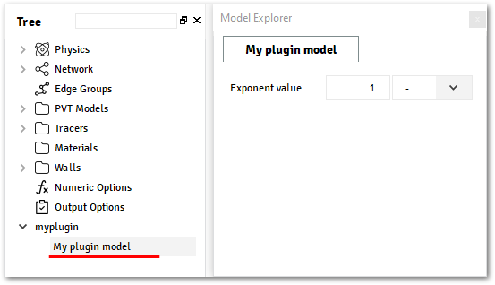
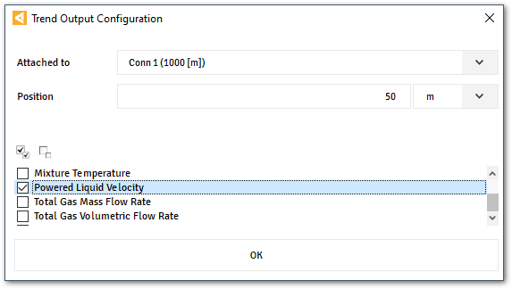
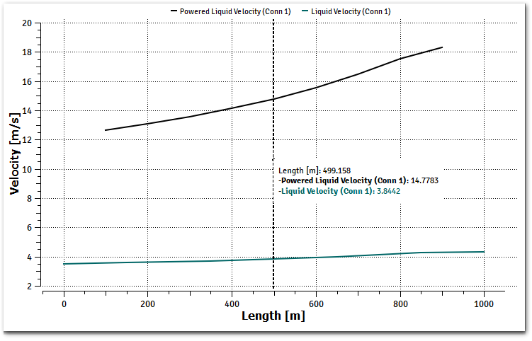

.. _plugin-by-example-section:

Plugin by Example
=================

In this section, we will continue to customize the template plugin created from the previous section,
this plugin will calculate the liquid velocity to the power of a given exponent provided by the user from the user interface.

The following equation describes the plugin:

.. math::

    var = U_{\text{liq}}^{n}

.. rubric:: Where

.. |a| replace:: :math:`U_{\text{liq}}`
.. |b| replace:: :math:`n`
.. |c| replace:: :math:`var`

:|a|: Liquid Velocity
:|b|: Exponent, input from user interface
:|c|: Plugin calculated value, that will be shown on the output.

For this, we will need to:

#. Create a simple input, on the user interface.
#. Add a secondary variable, to keep track of the value.
#. Retrieve the input data on the :py:func:`HOOK_INITIALIZE<alfasim_sdk.hook_specs.initialize>`.
#. Save the input data on a plugin internal data.
#. Get the liquid velocity from the solver, during run-time.
#. Export the value into the created/registered plugin secondary variable.

.. contents::
    :depth: 3
    :local:

Application customization
-------------------------

|sdk| allows plugins to customize the user interface of |alfasim| by adding custom models, the image below shows
the locations where a custom model can be inserted using the hook |gui_hook|.

.. image:: _static/images/alfasim_get_data_model_type_main.png

|marker_1| illustrates the section where the models |container| or |model| will be placed. |br|
|marker_2| illustrates the section where the inputs fields will be placed.

For this example we will use a :func:`~alfasim_sdk.models.data_model` entry over the Tree,
using a :func:`~alfasim_sdk.types.Quantity` field to get exponent value from the user.

The hook |gui_hook| needs to be implemented on the :file:`myplugin.py`, located on :file:`myplugin/src/python` folder.

.. rubric:: Implementation of :file:`myplugin.py`

.. code-block:: python

    import alfasim_sdk
    from alfasim_sdk.models import data_model
    from alfasim_sdk.types import Quantity

    @data_model(caption='My plugin model', icon='')
    class MyPluginModel:
        exponent = Quantity(value=1, unit='-', caption='Exponent value')

    @alfasim_sdk.hookimpl
    def alfasim_get_data_model_type():
        return [MyPluginModel]

Notice that only models that are returned by the hook :func:`~alfasim_sdk.hook_specs_gui.alfasim_get_data_model_type`
will be included on the user interface of |alfasim|.

The image below illustrates the application with the output from the snippet above.

For more details about all input fields available, check the section :ref:`api-types-section`.
And for more detail about the available models, check the section :ref:`api-models-section`.

.. _solver_customization:

Solver Configuration
--------------------

|sdk| provides hooks to customize the settings of the application that configures the solver internally,
some of these configurations are:

- Creation/Registration of new secondary variables
- Creation of new phases/fields/layers.
- Update of default phases and layers from the application.

For this example, a new |s_variable| will be created, to track the liquid velocity to the power of a custom value provided from the user.

A *Secondary Variable* is a variable that can be calculated along the `Network`. Also, if configured as external, this
variable will be set an Output, and will be available within the Trends and Profiles plots.

To create these variables, the hook |s_variable_hook| must be implemented in the :file:`myplugin.py` file.

.. rubric:: Implementation of :file:`myplugin.py`

.. code-block:: python

    @alfasim_sdk.hookimpl
    def alfasim_get_additional_variables():
        import alfasim_sdk
        from alfasim_sdk.variables import SecondaryVariable
        from alfasim_sdk.variables import Visibility
        from alfasim_sdk.variables import Location
        from alfasim_sdk.variables import Scope

        return [
            SecondaryVariable(
                name='U_liq_n',
                caption='Powered Liquid Velocity',
                unit='-',
                visibility=Visibility.Output,
                location=Location.Center,
                multifield_scope=Scope.Global,
                checked_on_gui_default=True,
            ),
        ]

The image below illustrates the application with the output from the snippet above.

For more details about ``SecondaryVariable``, check the section :ref:`api-variables-section`.

Hooks for Solver
----------------

|sdk| provides hooks that can customize the ``Solver`` behavior, this customization are implemented in C/C++ and can
make use of the :ref:`ALFAsim-SDK C/C++ API <sdk_api>` in order to fetch information from the application.

At this point, we are going to implement the :ref:`solver_hooks` that updates the secondary variable declared from
:file:`myplugin.py` file and retrieve the ``Liquid Velocity`` from the |alfasim|'s Solver.

First, we need to implement two mandatory hooks, the :py:func:`HOOK_INITIALIZE <alfasim_sdk.hook_specs.initialize>` and
the :py:func:`HOOK_FINALIZE <alfasim_sdk.hook_specs.finalize>`

With them it is possible to initialize any custom data (to store any important information) for internal use. Also it is
needed to load and unload the |sdk| API, in which will allows the plugin to use the API in any implemented `hook`.

.. rubric::  Implementation of :file:`myplugin.cpp`

.. code-block:: cpp

    ALFAsimSDK_API alfasim_sdk_api;

    struct MyPluginModel {
        double exponential = 0.0;
    };

    HOOK_INITIALIZE(ctx)
    {
        alfasim_sdk_open(&alfasim_sdk_api);

        int errcode = -1;
        double n = 0.0;

        errcode = alfasim_sdk_api.get_plugin_input_data_quantity(
            ctx,
            &n,
            get_plugin_id(),
            (const char*) "MyPluginModel.exponent");
        if (errcode != 0) {
            std::cout << "input_data_quantity error=" << errcode << "\n";
            return errcode;
        }

        int n_threads = -1;

        errcode = alfasim_sdk_api.get_number_of_threads(ctx, &n_threads);

        for (int thread_id = 0; thread_id < n_threads; ++thread_id) {
            // MyPluginModel is a class or struct defined by plugin
            auto* model = new MyPluginModel();
            model->exponential = n;
            errcode = alfasim_sdk_api.set_plugin_data(
                ctx,
                get_plugin_id(),
                (void*) model,
                thread_id
            );
        }

        return OK;
    }

    HOOK_FINALIZE(ctx)
    {

        auto errcode = -1;
        auto number_of_threads = -1;
        errcode = alfasim.get_number_of_threads(ctx, &number_of_threads);
        for (int thread_id = 0; thread_id < n_threads; ++thread_id) {
            MyPluginModel* model = nullptr;
            errcode = alfasim.get_plugin_data(ctx, (void**) (&model), get_plugin_id(), thread_id);
            delete model;
        }
        alfasim_sdk_close(&alfasim_sdk_api);

        return OK;
    }

Then, since the plugin wants to calculate its own secondary variable, the
:func:`HOOK_UPDATE_PLUGINS_SECONDARY_VARIABLES <alfasim_sdk.hook_specs.update_plugins_secondary_variables>` must be implemented.
As can be seen in the example below, to retrieve the velocity of the continuous liquid field
it is necessary to use the :func:`get_simulation_array` API function.

.. code-block:: cpp

    HOOK_UPDATE_PLUGINS_SECONDARY_VARIABLES(ctx)
    {
        int errcode = -1;

        // Get Liquid Field ID
        int liquid_field_id = -1;
        errcode = alfasim_sdk_api.get_field_id(
            ctx,
            &liquid_field_id,
            "liquid"
        )
        if (errcode != 0) {
            std::cout << "get_field_id error = " << errcode << "\n";
            return errcode;
        }

        // Get Liquid Field Velocity
        int n_faces = -1;
        double* U_liq = nullptr;
        errcode = alfasim_sdk_api.get_simulation_array(
            ctx,
            &U_liq,
            (char*) "U",
            VariableScope {
                GridScope::CENTER,
                MultiFieldDescriptionScope::FIELD,
                TimestepScope::CURRENT
            },
            liquid_field_id,
            &n_faces);
        if (errcode != 0) {
            std::cout << "get_simulation_array error = " << errcode << "\n";
            return OK;
        }

        // Get Exponent input data
        double n = 0.0;
        {
            int thread_id = -1;
            errcode = alfasim_sdk_api.get_thread_id(ctx, &thread_id);

            MyPluginModel* model = nullptr;
            errcode = alfasim_sdk_api.get_plugin_data(
                ctx, (void**) (&model),
                get_plugin_id(), thread_id
            );
            n = model->exponential;
        }

        // Get Plugin Secondary Variable
        int size = -1;
        double* U_liq_n_ptr = nullptr;
        errcode = alfasim_sdk_api.get_plugin_variable(
            ctx,
            (void**) &U_liq_n_ptr,
            "U_liq_n",
            0, // Global Scope
            TimestepScope::CURRENT,
            &size);
        if (errcode != 0) {
            std::cout << "get_plugin_variable error = " << errcode << "\n";
            return errcode;
        }
        // Calculating the 'U_liq' to power of 'n'
        for (int i = 0; i < size; ++i) {
            U_liq_n_ptr[i] = std::pow(U_liq[i], n);
        };

        return OK;
    }

The image below illustrates the output from the solver, when running the plugin created in this section with the given
network.

