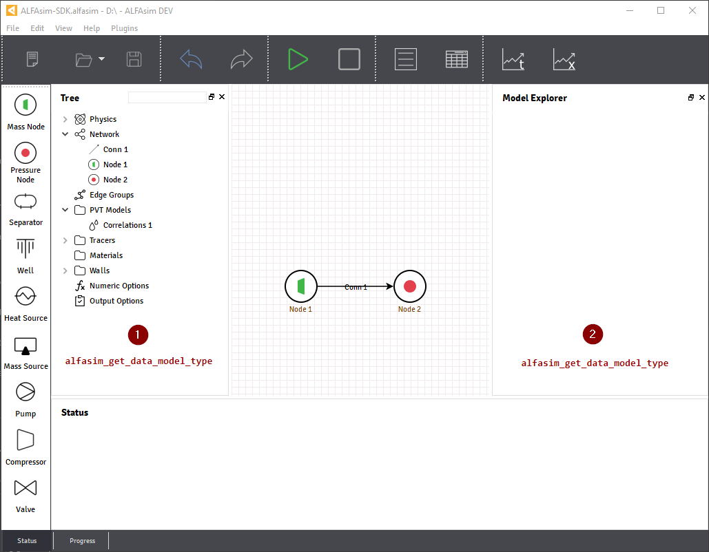

.. _plugin-by-example-section:

Plugin by Example
=================

In this section, we will continue to customize the template plugin create from the previous section,
this plugin example will have a simple input on the user interface application and issues a custom variable on
solver to be tracked during the simulation.

.. contents::
    :depth: 3
    :local:

Application customization
-------------------------

|sdk| allows plugins to customize the user interface of |alfasim| by adding custom models, the image bellow shows
the locations where a custom model can be inserted using the hook |gui_hook|.

|marker_1| illustrates the section where the models |container| or |model| will be placed.
|marker_2| illustrates the section where the the inputs fields will be placed.

For more details about all input fields available, check the section :ref:`api-types-section`.

When implementing the hook |gui_hook| it's necessary to inform which ``model`` will be used, |container| or a |model|.
For this plugin, we are going to use a simple model that only has one input field.

From :file:`myplugin.py` inside the :file:`myplugin/src/python` folder.

.. code-block:: python

    from alfasim_sdk.models import data_model
    from alfasim_sdk.types import Quantity

    @data_model(icon='logo.png', caption='My plugin model')
    class MyPluginModel:
        quantity = Quantity(value=1, unit='m', caption='Quantity Caption')

    @alfasim_sdk.hookimpl
    def alfasim_get_data_model_type():
        return [MyPluginModel]

Notice the hook |gui_hook| from the example above, only the models inside the list return by this hook will be included
on the user interface of |alfasim|.

.. _pre_solver_customization:

Pre-solver Customization
------------------------

|alfasim| provides hooks to customize the internal settings of the application that interacts internally with the solver and the application,
some of this configurations are: creation of new secondary variables, and  or new phases/fields/layers to be used.

For this sample plugin, a new |s_variable| will be created, to track the temperature of [ ... needs more details ...].
In order to create this variables, the hook |s_variable_hook| must be implemented from :file:`myplugin.py` file.

A ``SecondaryVariable`` can be used to [...], because [...].
For the full documentation of the SecondaryVariable check the :ref:`api-variables-section` section.

.. code-block:: python

    @alfasim_sdk.hookimpl
    def alfasim_get_additional_variables():
        from alfasim_sdk.variables import SecondaryVariable, Visibility, Location, Scope

        return [
            SecondaryVariable(
                name='annulus_temperature',
                caption='Annulus Temperature',
                unit='K',
                visibility=Visibility.Output,
                location=Location.Center,
                multifield_scope=Scope.Global,
                checked_on_gui_default=True,
            ),
        ]

Hooks for Solver
----------------

|alfasim| provides hooks that can customize the ``Solver`` behavior, this customization are implemented in C/C++ and can
make use of the `ALFAsim-SDK API` in order to fetch information from the application.

Given sequence for the sample plugin, in this last step we are going to implements the hook that update the secondary variable
declared from :file:`myplugin.py` file.

For this, first we need to implement two hooks that are mandatory, the :py:func:`HOOK_INITIALIZE <alfasim_sdk.hook_specs.initialize>` and :py:func:`alfasim_sdk.hook_specs.hook_finalize`
With the ``HOOK_INITIALIZE`` it's possible to initialize any custom routine for [ fill with more details ], also
with the alfasim_sdk_open [ details about alfasim_sdk_open]

.. code-block:: cpp

    ALFAsimSDK_API alfasim_sdk_api;

     HOOK_INITIALIZE(ctx)
    {
        alfasim_sdk_open(&alfasim_sdk_api);
        return OK;
    }

    HOOK_FINALIZE(ctx)
    {
        alfasim_sdk_close(&alfasim_sdk_api);
        return OK;
    }

In order to get [ details about the desired information ], you can get the information of [...]

.. code-block:: cpp

    HOOK_UPDATE_PLUGINS_SECONDARY_VARIABLES(ctx)
    {
        int errcode = -1;

        // Workaround for ignoring update secondary variables
        // for internal nodes
        double* dummy_ptr = nullptr;
        int n_control_volumes = -1;

        errcode = alfasim_sdk_api.get_simulation_array(
            ctx,
            &dummy_ptr,
            (char*) "rho",
            VariableScope {
                GridScope::CENTER, MultiFieldDescriptionScope::MIXTURE, TimestepScope::CURRENT },
            0,
            &n_control_volumes);
        if (n_control_volumes == 1) {
            return OK;
        }

        int size = -1;
        void* annulus_temperature_void_ptr = nullptr;
        errcode = alfasim_sdk_api.get_plugin_variable(
            ctx,
            &annulus_temperature_void_ptr,
            "annulus_temperature",
            0,
            TimestepScope::CURRENT,
            &size);
        if (errcode != 0) {
            throw std::runtime_error("Error on get_plugin_variable (annulus_temperature)");
        }

        auto annulus_temperature_double_ptr = static_cast<double*>(annulus_temperature_void_ptr);

        int n_interfaces = -1;
        double* T_wall_interfaces = nullptr;
        for (int i = 0; i < size; ++i) {
            errcode = alfasim_sdk_api.get_wall_interfaces_temperature(
                ctx, &T_wall_interfaces, i, TimestepScope::CURRENT, &n_interfaces);
            if (errcode != 0) {
                throw std::runtime_error("Error on get_wall_interfaces_temperature");
            }

            if (n_interfaces > 2) {
                annulus_temperature_double_ptr[i] = T_wall_interfaces[2];
            } else if (n_interfaces > 1) {
                annulus_temperature_double_ptr[i] = T_wall_interfaces[1];
            } else {
                annulus_temperature_double_ptr[i] = T_wall_interfaces[0];
            }
        };

        return OK;
    }
