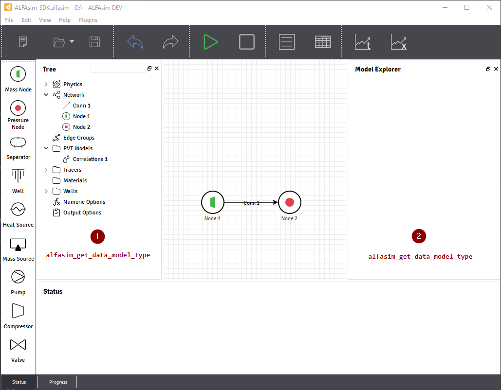

.. _plugin-by-example-section:

Plugin by Example
=================

In this section, it's showed how to customize the template plugin create from the previous section,
this plugin example will have a simple input on the graphical interface and issues a custom variable on
solver to be tracked during the simulation.

This allows you to experience the complete workflow in a short time.

.. contents::
    :depth: 3
    :local:

User interface customization
----------------------------

Custom models can be added to ALFAsim, the image bellow shows the places where a custom model can be inserted.
with the hook :py:func:`alfasim_get_data_model_type`.

In order to insert a new entry over the **Tree Structure** |marker_1|, it's necessary to use either a
:py:func:`alfasim_sdk.models.container_model` or a :py:func:`alfasim_sdk.models.data_model`
Both models mentioned above accepts fields, each field will be inserted over the **Model Explorer** |marker_2|.

For the sample plugin, a :py:func:`alfasim_sdk.models.data_model` will be created with a :py:func:`alfasim_sdk.types.Quantity`

Pre-solver Customization
------------------------

Hooks for Solver
----------------
