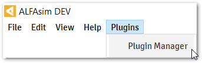
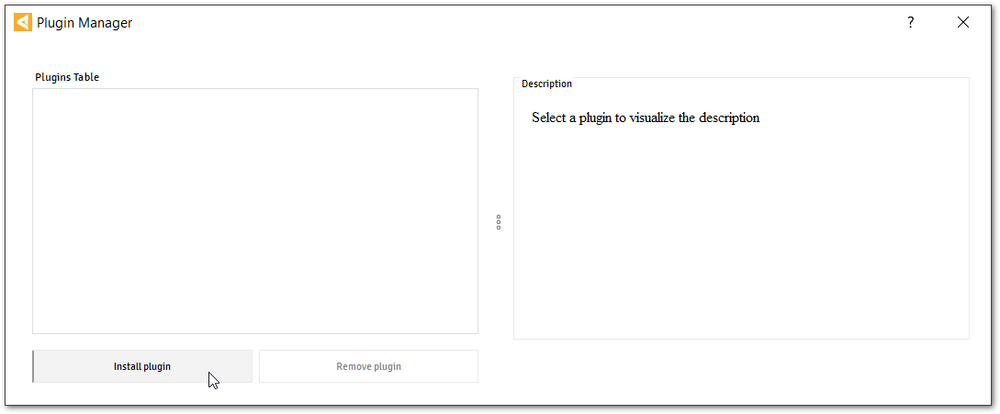
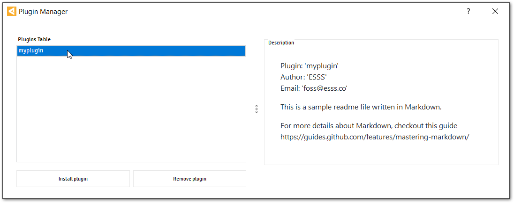
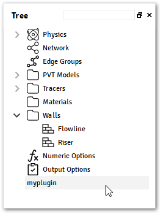

.. _quick-start-section:

Quick Start
===========

.. |alfasim| replace:: :program:`ALFAsim`
.. |sdk| replace:: :program:`ALFAsim-SDK`

In this section, it's showed how to create a plugin from scratch with the template command provided by |sdk|.
With this template, you can easily customize your application to extended |alfasim| functionality.

This allows you to experience the complete creation of a plugin workflow in a short time.

Set up the environment
----------------------

The |sdk| is a Python package that helps developers in the process to create a Plugin for |alfasim|, to use
this tool it's necessary to have a Python Interpreter with at least version 3.6. For more details on `how to install Python check
the docs <https://www.python.org/downloads/>`_

.. note::

    It is recommended that you install the |sdk| using a Python Virtual Environment.
    For more details, see Virtual Environments and Packages in Python documentation.

From a terminal, install the |sdk| with :command:`pip` command.

.. code-block:: console

    pip install alfasim-sdk

Also, make sure to have `CMake` at least version `3.5.2` installed and the `Ninja` package.

Creating a Plugin
-----------------

Execute the |sdk| template command, to generate an empty plugin.

.. code-block:: console

    alfasim-sdk template

A series of information will be requested:

  * **Plugin Caption**: Caption to be used across the user interface to identify the plugin.
  * **Plugin Id**: The name of the plugin to be referenced during the development.
  * **Author Name**: Name of the plugin author to be displayed.
  * **Author Email**: Email of the plugin author to be displayed.

.. code-block:: console

    >>> alfasim-sdk template
    -- Plugin Caption: Myplugin
    -- Plugin Id: myplugin
    -- Author Name: ESSS
    -- Author Email: alfasim@esss.co

The generated plugin template will contain the following structure:

.. code-block:: console

    \---myplugin
        |   CMakeLists.txt
        |   compile.py
        |
        +---assets
        |       plugin.yaml
        |       README.md
        |
        \---src
            |   CMakeLists.txt
            |   hook_specs.h
            |   myplugin.cpp
            |
            \---python
                    myplugin.py

The highlights here are for:

:guilabel:`plugin.yaml`
    File with all information about the plugin that will be used by |alfasim|.

:guilabel:`myplugin.py`
    Implementation of the hooks for customization of the UI interface, or the pre-solver hooks

:guilabel:`myplugin.c`
    Implementation of the hooks for customization of solver

Check out the :ref:`Plugin Structure section <plugin_structure-section>` for more details about how the folder and files are structured, and
also, check the :ref:`plugin-by-example-section` that shows how to create simple plugins that make use of the `User Interface Hooks` and the `Solver Hooks`.

Creating a package
------------------

From the root directory of the plugin, execute the command `alfasim-sdk package`.
This command will compile your C/C++ implementation and include the shared libraries inside a `artifacts` directory and
the generated plugin on the root directory with the extension `hmplugin`.

.. code-block:: console

    >>> cd myplugin
    >>> alfasim-sdk package
    -- Package Name: myplugin

The plugin directory will have the following structure when executing from a `Windows Operating System`:

.. code-block:: console

    \---myplugin
        |   CMakeLists.txt
        |   compile.py
        |   myplugin-1.0.0-win64.hmplugin
        |
        +---artifacts
        |       myplugin.dll
        |       myplugin.lib
        |
        +---assets
        |       plugin.yaml
        |       README.md
        |
        +---build
        |       < ... >
        |       < ... >
        |
        +---package
        |       myplugin.dll
        |       plugin.yaml
        |       README.md
        |
        \---src
            |   CMakeLists.txt
            |   hook_specs.h
            |   myplugin.cpp
            |
            \---python
                    myplugin.py

Installing the package on ALFAsim
---------------------------------

With :file:`myplugin.hmplugin` file, it's now possible to install it on |alfasim| application.
From the menu bar select the `Plugin Manager` option, as illustrated in the figure bellow:

In the `Plugin Manager` windows, install :file:`myplugin.hmplugin` file plugin.

By clicking on the plugin name, it's possible to visualize the content from the :file:`README.md` file.

Restart the application and check the recently installed plugin available over the :guilabel:`Tree`.

